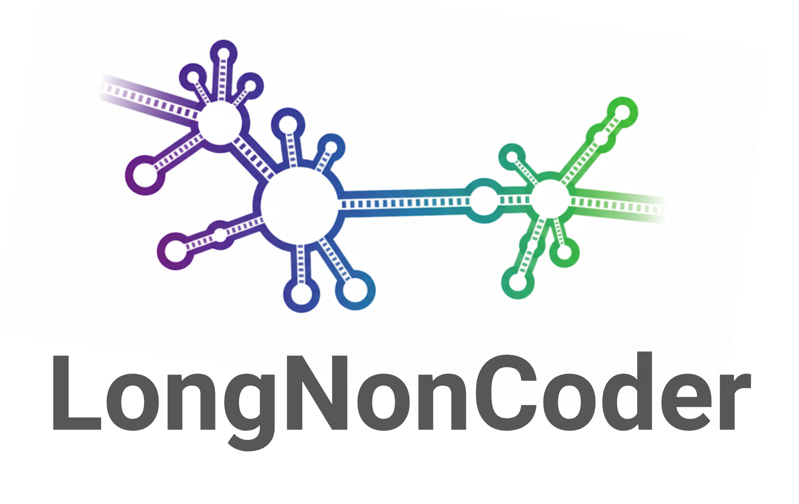
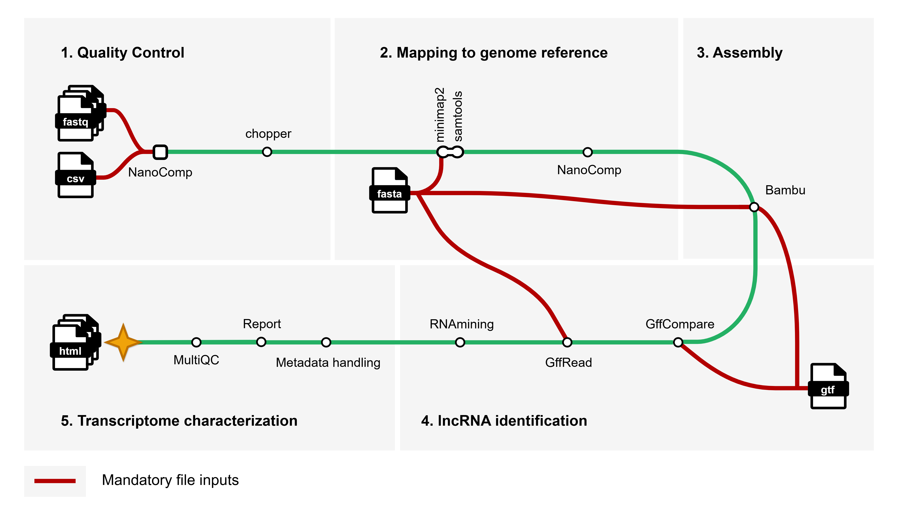

<h1>
  <picture>
    <source media="(prefers-color-scheme: dark)" srcset="docs/images/longnoncoder-logo-dark.png"> 
     
  </picture>
</h1>

[](https://www.nextflow.io/) [](https://sylabs.io/docs/) [](https://tower.nf/launch?pipeline=https://github.com/integrativebioinformatics/longnoncoder) [](https://github.com/codespaces/new/integrativebioinformatics/longnoncoder)

## Introduction

**integrativebioinformatics/longnoncoder** is a bioinformatics nextflow pipeline that provides a comprehensive analysis of raw long-read RNA-seq data, encompassing transcriptome assembly, quantification, and characterization. The pipeline reports a detailed overview on the entire transcriptome with particular emphasis on lncRNA structure and isoforms across annotated transcripts and novel candidates.

> [!IMPORTANT]
> LongNonCoder is compatible Ensembl reference genomes and annotations from the following organisms: > *Homo sapiens, Mus musculus, Danio rerio, Anolis carolinensis*, *Chrysemys picta belli, Eptatetrus burgeri, Gallus gallus, Latimeria chalumnae, Monodelphis domestica, Notechis scutatus, Ornithorhynchus anatinus*, *Petromyzon marinus, Sphenodon punctatus,* and *Xenopus tropicalis.* **In the next releases, we plan to update the pipeline workflow to cover more organisms or even more general taxonomic classes.**

#### The workflow



We can describe each step of the workflow as follows:

1.  Quality control of reads ([NanoComp](https://github.com/wdecoster/nanocomp "wdecoster/nanocomp"))
2.  Filtering and trimming ([chopper](https://github.com/wdecoster/chopper "wdecoster/chopper"))
3.  Mapping to a genome reference ([minimap2](https://github.com/lh3/minimap2 "lh3/minimap2") and [samtools](https://github.com/samtools/samtools "samtools"))
4.  Quality control of mapped reads ([NanoComp](https://github.com/wdecoster/nanocomp "wdecoster/nanocomp"))
5.  Transcriptome Assembly ([Bambu](https://github.com/GoekeLab/bambu "GoekeLab/bambu"))
6.  Compare novel transcripts to the annotation reference ([GffCompare](https://github.com/gpertea/gffcompare "gpertea/gffcompare"))
7.  Convert novel transcripts `GTF` file to `FASTA` ([GffRead](https://github.com/gpertea/gffread "gpertea/gffread"))
8.  Predict transcripts as protein-coding or non-coding ([RNAmining](https://gitlab.com/integrativebioinformatics/RNAmining "integrativebioinformatics/RNAmining"))
9.  Gather all data from previous steps and generate informative and re-usable metadata `.csv` and `GTF` files for both novel and annotated transcripts (Metadata handling)
10. Provide a report and data visualization for the full transcriptome, with emphasis on lncRNAs (Report)
11. Gather all possible QC information from the previous steps ([MultiQC](https://github.com/MultiQC/MultiQC "MultiQC"))

## Usage

> [!NOTE]
> If you are new to Nextflow and nf-core, please refer to [this page](https://nf-co.re/docs/usage/installation) on how to set-up Nextflow. Make sure to [test your setup](https://nf-co.re/docs/usage/introduction#how-to-run-a-pipeline) with `-profile test` before running the workflow on actual data. The pipeline is compatible with both Docker and Singularity.

You can run an example test by following the instructions:

Enter the `test_data` folder

``` bash
cd test_data
```

Download and unzip the reference `FASTA` and `GTF` files, and also download the fastq.gz files:

Make the file executable!!

``` bash
chmod +x download-ref.sh
```
Run it
``` bash
./download-ref.sh
```

Add YOUR full path for the samples in the `samplesheet.csv` ([file](test_data/samplesheet.csv)). For example, your full path for a sample could be:

`home/user/longnoncoder/test_data/thesample.fastq.gz`

Go back to the main directory and execute the test!

``` bash
cd ..
```

``` bash
nextflow run main.nf -profile test,singularity -params-file test_data/testing.yml
```

> [!WARNING]
> Please provide pipeline parameters via the CLI or Nextflow `-params-file` option and input a `yaml` parameters file. Custom config files including those provided by the `-c` Nextflow option can be used to provide any configuration ***except for parameters***; see [docs](https://nf-co.re/usage/configuration#custom-configuration-files).


For more details and further functionality, please refer to the [usage documentation](docs/usage.md).

## Pipeline output

To see the results of an example test run with a full size dataset refer to the [results](test_data/results) tab on the nf-core website pipeline page. For more details about the output files and reports, please refer to the [output documentation](docs/output.md).

## Credits

integrativebioinformatics/longnoncoder was originally written by Bárbara Borges and Lucas Freitas.

We thank the following people for their extensive assistance in the development of this pipeline:

João Cavalcante

Gleison Azevedo

Rodrigo Dalmolin

Thaís Gaudencio

Vinícius Maracajá-Coutinho

<h1>
    <picture> 
        <source media="(prefers-color-scheme: dark)" srcset="docs/images/institutional-logos-dark-theme.png"> 
         
    </picture>
</h1>

## Contributions and Support

If you would like to contribute to this pipeline, please see the [contributing guidelines](.github/CONTRIBUTING.md).

## Citations

An extensive list of references for the tools used by the pipeline can be found in the [`CITATIONS.md`](CITATIONS.md) file.
